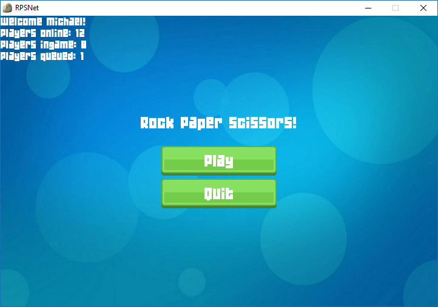
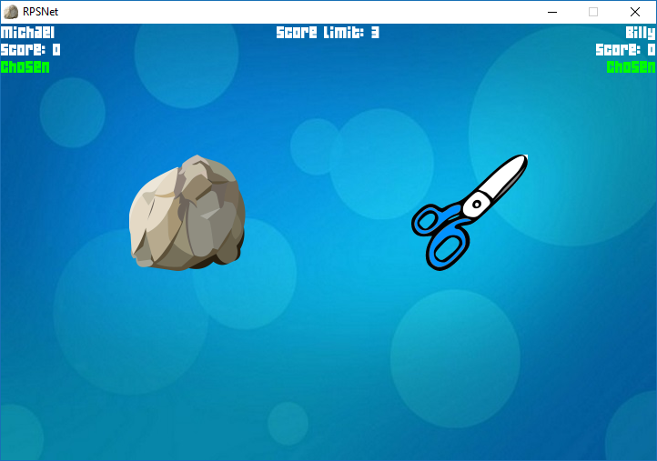
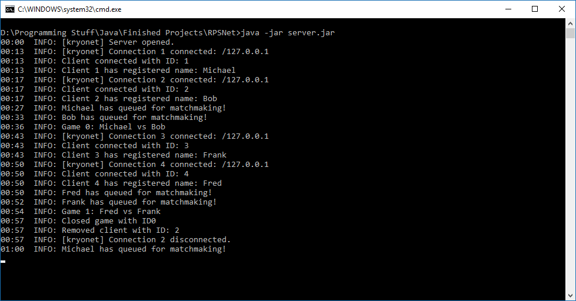

# RpsNet
An online Rock-Paper-Scissors game made in Java using Kryonet and LibGDX, complete with a fully functional matchmaking system!
There is a client and a server project.

# Client
Users run the client, input the IP address that the server is running on and a player name, and are then connected to the server.
From here users can queue up for matchmaking, which is all handled by the server, allocating players to games when it can find a pair of queued players.

When ingame, players play a game of rock-paper-scissors against another human opponent. The first to 3 points is declared the winner and players are returned to the menu.

# Server
Only one server instance can be run per machine.
There are two options for running the server, either straight from the server.jar file, or from the RunServerCmd.bat file.
The former will run the server in the background, the latter in a command window, which is recommended.

The server is ran on port 54555-54556, so if you want to be able to connect to clients outside of a LAN, you will have to portforward these ports.
Once the server has been launched, clients can connect to it with its IP address, and the server will handle matchmaking and gameplay for any connected clients.

